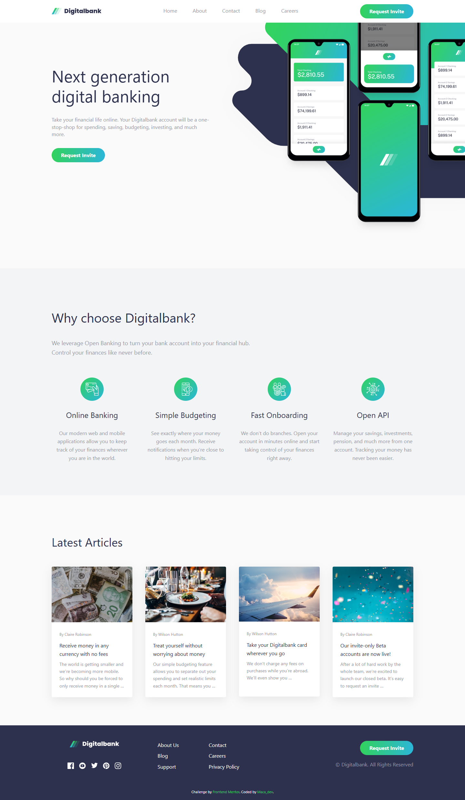

# Frontend Mentor - Digitalbank landing page solution

This is my solution to the [Digitalbank landing page challenge on Frontend Mentor](https://www.frontendmentor.io/challenges/digital-bank-landing-page-WaUhkoDN). Frontend Mentor challenges help you improve your coding skills by building realistic projects.

## Table of contents

- [Overview](#overview)
  - [The challenge](#the-challenge)
  - [Screenshot](#screenshot)
  - [Links](#links)
- [My process](#my-process)
  - [Built with](#built-with)
- [Author](#author)

## Overview

### The challenge

Users should be able to:

- View the optimal layout depending on their device's screen size
- See hover states for all interactive elements

### Screenshot

### Links

- Solution URL: https://www.frontendmentor.io/solutions/digitalbank-landing-page-jU4tQ7hinc
- Live Site URL: https://macauy.github.io/Digital-Bank-website/

## My process

### Built with

- Semantic **HTML5**
- **CSS** (custom properties, `clamp()`, Grid & Flexbox)
- **Vanilla JS** for mobile nav toggle and accessibility (ESC to close, overlay click)
- Mobile-first workflow

## Author

- GitHub — https://github.com/macauy
- Frontend Mentor — https://www.frontendmentor.io/profile/macauy
